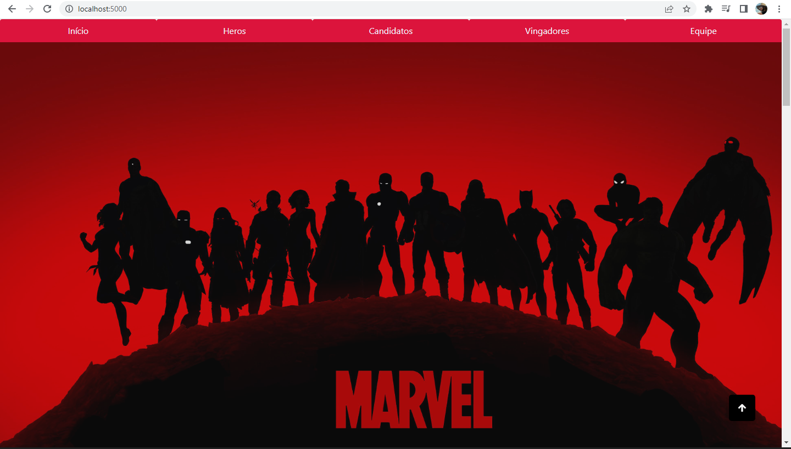

# Challenge Marvel
*Project for web 2023©

## POV
### connect > localhost:5000

## Stacks
- Fonte de Dados: [API Marvel](https://developer.marvel.com/)
- Framework: Flask
- ORM: SQLAlchemy
- Banco: SQLite
- Docker
- ssl(ZeroSSL) + domain(netlify) > in progress..

## Funcionamento:
- `Funcionalidade 1`: listar todos os heróis com foto, nome e descrição
- `Funcionalidade 2`: selecionar um ou mais heróis para a tabela de candidatos
- `Funcionalidade 2a`: montar equipes
- `Funcionalidade 3`: listar equipes montadas ( Equipe e Vingadores )

## Operation:
- `Feature 1`: list all heroes with photo, name and description
- `Feature 2`: select one or more heroes for the candidate table
- `Feature 2a`: assemble teams
- `Feature 3`: list assembled teams (Team and Avengers)

## Instalação:
- Clone este repositório
- > cd challenge_marvel > code .
- > pip install -r requirements.py
- > Configure os dots da sua env no arquivo de configuração (config.py)
- > O projeto utiliza o SQLite3, realize o migrate e upgrade após create db. > flask db init, flask db migrate, flask db upgrade
- > run: python run.py runserver
- ``teste
- > connect no browser: localhost:5000

## Installation:
- Clone this repository 
- > cd challenge_marvel > code . 
- > pip install -r requirements.py 
- > Configure your environment dots in the configuration file (config.py)
- > The project uses SQLite3, perform the migrate and upgrade after create db. > flask db init, flask db migrate, flask db upgrade 
- > run: python run.py runserver 
- > connect to the browser: localhost:5000

## Overview:
 - in progress..

## Deploy:

